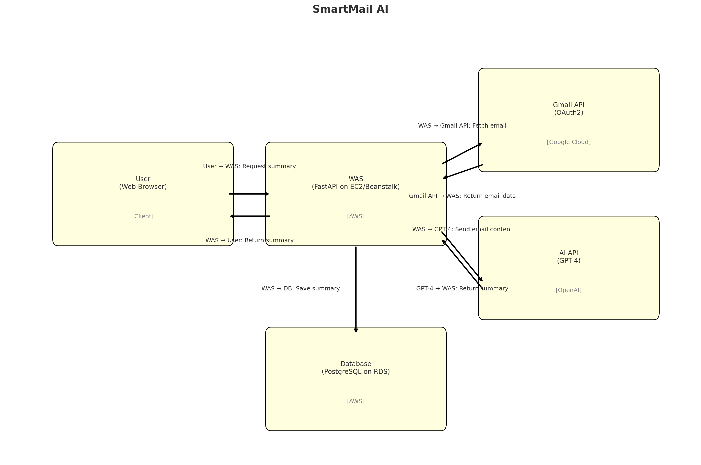

# 📬 SmartMail-AI

## A. 프로젝트 명
**SmartMail-AI**: 인공지능 기반 이메일 요약 및 분류 시스템

## B. 프로젝트 멤버 및 담당 파트
- **고영태**: 백엔드 개발 (Gmail API 연동 및 인증)
- **이세형**: 프론트엔드 개발 및 AWS 인프라 관리
- **유지호**: 백엔드 개발 (AI 요약 로직 및 Gemini 연동)
- **허취원**: 백엔드 개발 (DB 관리)

## C. 프로젝트 소개
SmartMail-AI는 사용자의 Gmail 계정에서 이메일을 가져와, Google의 Gemini API를 활용하여 내용을 요약, 중요도 판단, 카테고리별로 분류해주는 스마트 이메일 요약/분류 시스템입니다.

## D. 프로젝트 필요성 소개
현대인들은 하루에도 수십 통의 이메일을 수신합니다. 불필요한 스팸, 중복 안내, 긴 뉴스레터 등으로 인해 중요한 메일을 놓치거나 피로도가 증가하는 문제가 있습니다. 이 프로젝트는 인공지능을 활용해 긴 이메일의 핵심을 자동으로 요약하고 중요도를 분석하여, 효율적인 이메일 확인과 분류를 가능하게 합니다.

## E. 관련 기술 및 참고 자료
1. [Superhuman](https://superhuman.com)
    - AI 기반 이메일 클라이언트로 빠른 응답 제공
    - 요약보다는 생산성 향상 중심

2. [Shortwave](https://www.shortwave.com)
    - Gmail 기반으로 AI 요약 기능 제공
    - GPT 기반 AI Summarization

## F. 개발 결과물 소개

### 📌 시스템 구성도

### 주요 기능
- Gmail OAuth2 인증
- 이메일 제목 및 본문 요약
- 카테고리별 이메일 필터링 (중요, 일정, 알림 등)
- 개별 이메일 상세 보기

## G. 개발 결과물 사용 방법

### 1. AWS EC2 도메인 접속
```bash
http://smartmail.cla6sha.de
```
<!--  -->
### 2. 로컬에서 사용
```bash
git clone https://github.com/SmartMail-AI/project
```

#### 2-1. 백엔드 실행
```bash
cd backend
python -m venv venv
source venv/bin/activate  # Windows: venv\Scripts\activate
pip install -r requirements.txt
uvicorn main:app --reload
```

##### 필요한 환경 변수 (.env)
```
GEMINI_API_KEY=your_google_api_key
GMAIL_CLIENT_ID=...
GMAIL_CLIENT_SECRET=...
JWT_SECRET_KEY=...
OAUTH_REDIRECT_URI=http://localhost:8000/api/auth/google/callback
SPA_REDIRECT_URI=http://localhost:5173/auth/result
MODE=development
```

#### 2-2. 프론트엔드 실행
```bash
cd frontend
npm install
npm run dev
```

##### 필요한 환경 변수 (.env)
```
VITE_SERVER_URL=http://localhost:8000
```

## H. 활용 방안
- **개인 사용자**: 이메일 요약 기능을 통해 중요한 정보 빠르게 파악
- **기업**: 고객 응대 메일 자동 분류 및 핵심 정보 분석
- **리서치 기관**: 대량 이메일 내용 요약 및 카테고리 분석 실험 가능

---
